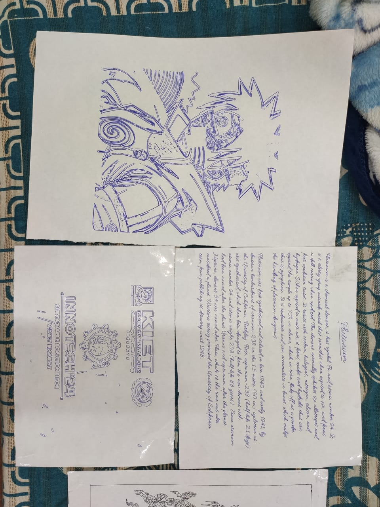
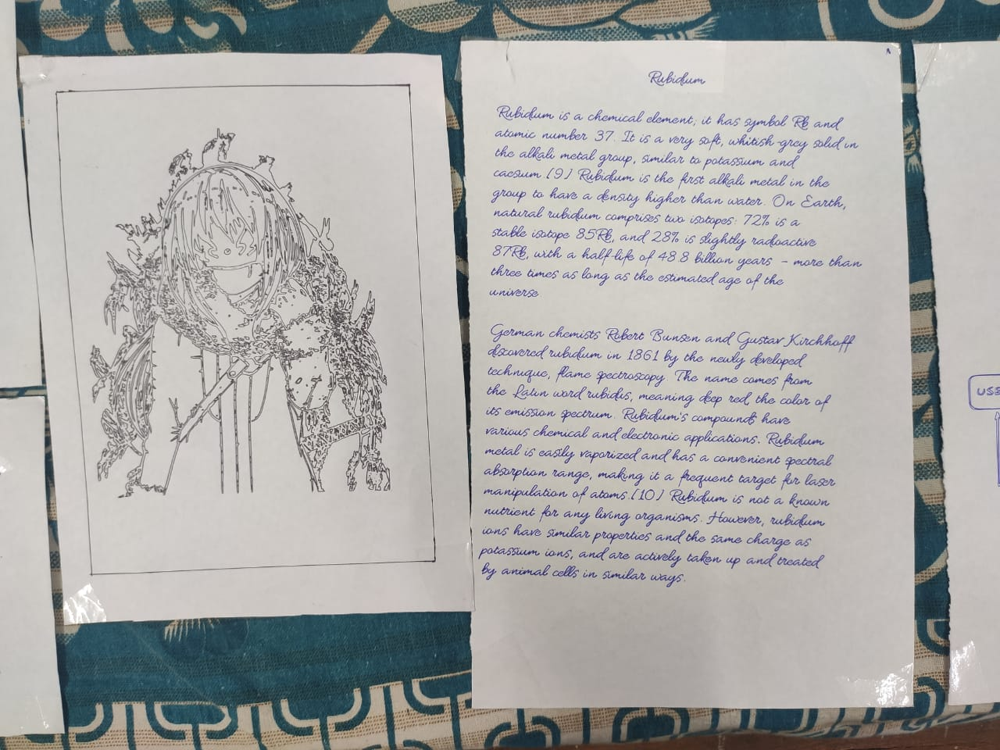
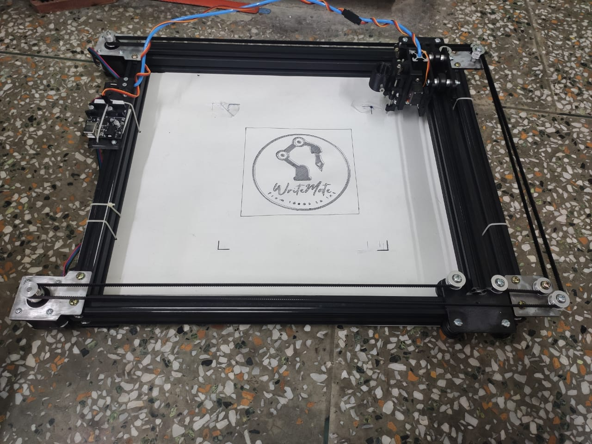
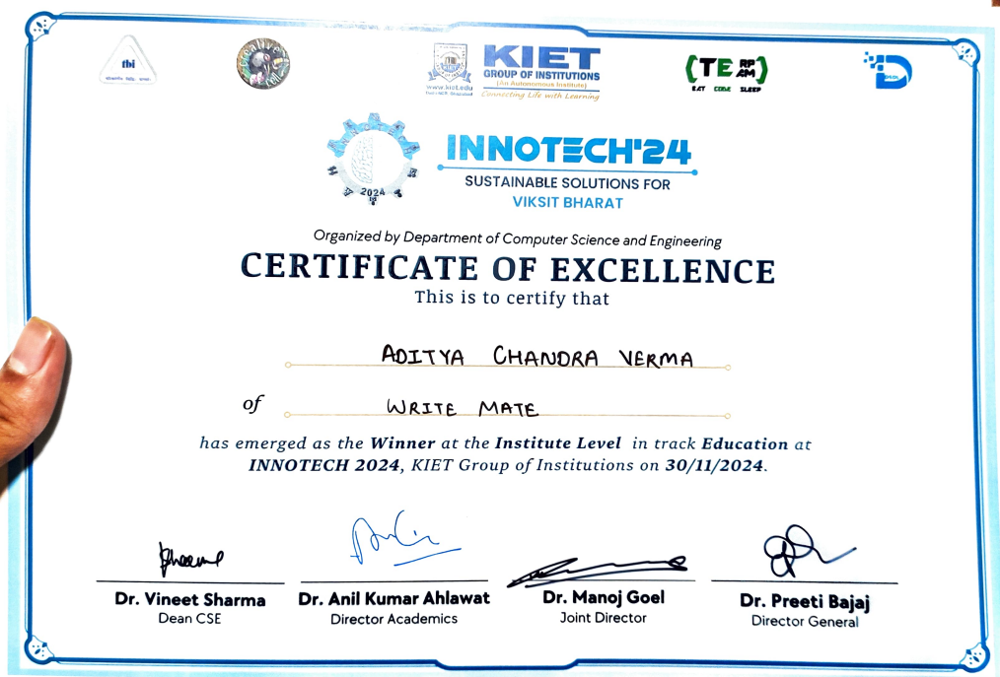
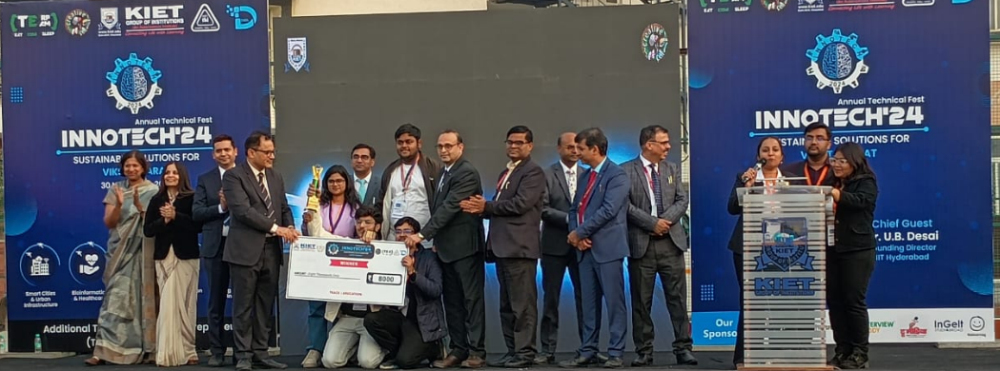

# WriteMate – Voice & Gesture Controlled Writing Machine

**WriteMate** is an intelligent assistive device that enables users to write on paper using **hand gestures and voice commands**. It is built using **Python, OpenCV, MediaPipe, TensorFlow Lite**, and a custom **CoreXY-based CNC mechanism** powered by **GRBL firmware**. Ideal for visually or physically challenged individuals, WriteMate converts spoken or signed input into SVG, G-code, and finally physical handwriting.

---

## Features

- Real-time **voice-to-text** using [Vosk](https://alphacephei.com/vosk/) with confirmation logic
- **ISL gesture detection** via webcam using a custom TFLite model
- Text accumulation and live preview via **Tkinter GUI**
- Generates scalable **SVG text** with custom fonts and sizes
- Converts SVG to **G-code** using `py_svg2gcode`
- Sends G-code to a **GRBL CoreXY CNC machine** via serial communication
- Fully functional **GUI controls** for font, pen pressure, speed, and writing modes

---

## Project Structure

```
WriteMate/
├── Gesture_Voice_Detection.py     # Main Python script for voice + gesture control
├── requirements.txt               # Python dependencies
├── config.json                    # Customizable runtime configuration
├── Modified_GRBL/                 # Modified GRBL firmware for CoreXY & servo support
│   └── ...                        # GRBL source (.c/.h/.ino)
└── output.svg / output.nc         # Auto-generated files (SVG, G-code)
```

---

## Technologies Used

- **Python 3**, **Tkinter**, **OpenCV**, **MediaPipe**
- **Vosk** (offline voice recognition)
- **TensorFlow Lite** (gesture classification)
- **Cairo + Pango** (SVG text rendering)
- **py_svg2gcode** (SVG to G-code)
- **GRBL (CoreXY)** on Arduino Uno
- **Serial communication** via `pyserial`

---

## Installation

```bash
git clone https://github.com/ADITYACHANDRA2003/WriteMate.git
cd WriteMate
pip install -r requirements.txt
```

Ensure you also install:
- [Vosk Model](https://alphacephei.com/vosk/models) (place path in `config.json`)
- Your trained **ISL TFLite model**

---

## How It Works

1. User speaks a word → system asks "confirm?"
2. On “yes”, text gets queued for writing
3. Simultaneously, gestures are captured & interpreted into letters
4. Text is compiled → converted into SVG → G-code
5. G-code sent to CNC via serial (e.g., `M3 S0` / `M3 S255` for pen up/down)

---

## Configuration

Customize behavior via `config.json`:

```json
{
  "vosk_model_path": "model/vosk-model-en-in",
  "isl_model_path": "model/isl_model.tflite",
  "serial_port": "COM8",
  "baud_rate": 115200,
  "writing_area": [220, 180],
  "line_spacing": 5,
  "grammar_words": ["hello", "yes", "no", "repeat", "india", "name"]
}
```

---

## Screenshots


## Achievements

- 🥇 **Innotech 2024 Winner** – ₹8,000 prize
## System Overview

### Example
<p align="center">
  
</p>

### Example
<p align="center">
  
</p>

### Hardware Setup
<p align="center">
  
</p>

### Certificate and Recognition
<p align="center">
  
</p>
<p align="center">
  
</p>

---

# Author

**Aditya Chandra Verma**  
B.Tech CSE | Computer Vision | Embedded AI | Robotics  
📧 [adityachandraverma@gmail.com](mailto:adityachandraverma@gmail.com)  
🔗 [GitHub](https://github.com/ADITYACHANDRA2003)

---

## 📅 Last Updated
July 08, 2025
